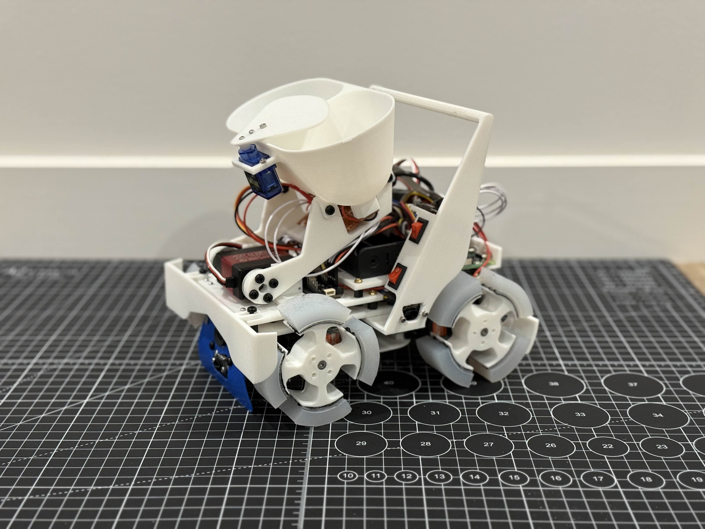

# FusionZero 2025

This is a continuation of our progress, following:
- [N/A] Robocup Singapore Open 2024
- [2nd] Robocup Australia Open 2024

This repository tracks progress through:
- [4th] Robocup Japan Open 2025
- [2nd] Robocup Singapore Open 2025
- [6th] Robocup International, Salvador, Brazil 2025
- [1st] Robocup Australia International 2025

---

# Project Overview
## Software
- **Coding Language**: Python. *It once was Arduino cpp, but as we swapped from microcontrollers to SBCs, it's use got harder to justify, especially considering implementing image classificaiton models.*
- **Development Software**: VSCode, VIM, X11 forwarding, RealVNC. *We used to use Arduino IDE V2 when we needed it*
- **Operating System**: Raspberry Pi OS Bullseye *Selected for consistency with python 3.9 and attempts at using the Google Coral TPU*
- **CAD Package**: Onshape. *We used to use Fusion, until our hardware started limiting us*

## Hardware
- **Processor**: Rasperry Pi 4B with custom shield
- **Drivechain**: 4x 360 degree continuous servos, 1x 270 degree claw servo, 1x 180 degree claw servo
- **Power supply**: 2S 18650 @ 7.4V nominal
- **Sensors**: 3x ToF, 2x Camera, 2x Limit switches, 8x IR Colour, 2x visable colour
- **Manufacture**: 3D printed, majority with Creality K1 Max with PLA and TPU.

# Repository Overview
## 0_setup
This folder includes auto-setup scripts to automate the process of setting up and using the Raspberry Pi.

1. [0_sub_ethernet](0_setup/0_usb_ethernet.sh) sets up the Raspberry Pi as a USB gadget, utilising Ethernet-OTG, allowing us to SSH over wire instead of depending on wireless means. Furthermore, it sets a static, memorable static IP address for both usb0 and wlan0 connections, configures the I2C speed, and enables SSH. These are all done as headless-setups were common fiddling with HDMI and requiring a display and external keyboard was a death sentence for competitions.

2. [1_system_packages](0_setup/1_system_packages.sh) updates and upgrades the system, while also installing all core packages for both the system and the robot (especially the TF library, Google Coral, and picamera)

3. [2_sensor_libraries](0_setup/2_sensor_libraries.sh) is exactly as it says. Installs all sensor libraries the project uses.

4. [3_smoke_test](0_setup/3_smoke_test.py) tests that everything has been installed correctly and can be used.

5. [4_autostart_setup](0_setup/4_autostart_setup.sh) was only used before competitions to autostart a program without needing SSH connection, as well as disabling all image forwarding and starts recording into a debug log.

## 1_international
[Behaviours](1_international/behaviours)  act as interface between the competition and the code: it explicitly defines how the robot behaves in certain conditions.
- [line_follower](1_international/behaviours/line_follower.py) defines the line_follower class and all associated methods and variables
- [line](1_international/behaviours/line.py) describes the actual logic behind the line_following segment of the competiton, including handlin all obstacles such as obstacles, speedbumps, gaps, ramps, and evacuation zone entry.
- [evacuation_zone](1_international/behaviours/optimized_evacuation.py) outlines both the evacuation state defines the evacuation logic. This includes identifying victims, routing and grabbing, dumping, and finally exiting.
- [robot_state](1_international/behaviours/robot_state.py) is used in line following the track the current robot state. Initialised with default values.
- [silver_detection](1_international/behaviours/silver_detection.py) is the class that defines silver identification with a custom TFlite image classification model.

[Core](1_international/core) defines core helper functions necessary to run all programs in behaviours.
- [listener](1_international/core/listener.py) is an active listener that acts as a toggle switch to start and interrupt programs, which "allowed" us to use while "true" loops in our program. (Just ctrl + f for "while true" and replace with "while listener.mode.value != 0").
- [shared_imports](1_international/core/shared_imports.py) imports all libraries once at the beginning of a run. This means that there are no pauses during the run itself. However, a large issue was if the robot required a power reset, this process would take a long time.
- [utilities](1_international/core/utilities.py) tracks the Raspberry Pi health, outlines recording settings, and defines debuging methods.

[Hardware](1_international/hardware)
- [Calibration_values](1_international/hardware/calibration_values) is a folder that stores the individual calibration values for motors and colour sensors for both robots between runs.
- [fonts](1_international/hardware/fonts) holds the fonts used for the OLED display for debugging.
- [claw](1_international/hardware/claw.py) defines mehtods used by the claw, such as lifting, grabbing, and reading claw sensors
- [colour_sensors](1_international/hardware/colour_sensors.py) defines its auto-calibration method, and reading both raw and adjusted values for use.
- [evacuation_camera](1_international/hardware/evacuation_camera.py) defines the evacuation camera used in the evacuation zone and it's parameters.
- [gyroscope_sensor](1_international/hardware/gyroscope_sensor.py) reads the gyroscope and converts its units from quaterions into pitch, roll, yaw.
- [laser_sensors](1_international/hardware/laser_sensors.py) defines 3 ToF sensors pointing to the front, left, and right, and handles setup for continuous reading and outputting data.
- [LED](1_international/hardware/led.py) defines the behvaiour for a debugging LED
- [motors](1_international/hardware/motors.py) defines several key motor methods, such as run and run_until, as well as carrying all calibration values
- [OLED_Display](1_international/hardware/oled_display.py) defines the setup for the display for debugging, and abstracts the method for writing text easily.
- [Robot](1_international/hardware/robot.py) initialises the robot and all components it has, outputting it onto the debugging screen.
- [Silver_sensors](1_international/hardware/silver_sensor.py) defines the silver sensor, used in conjunction with the TFLite image classification model.
- [Touch_sensors](1_international/hardware/touch_sensors.py) defines the touch sensors and its associated behaviours.

[Tests](1_international/tests) exposes all these core packages and behaviours to do isolated testing wtihout the need of copying and pasting code that is dependent on many other things. This allows us to accerlerate the testing we do, as well as have complicated testing scripts reading for competition for adjustment.

[main.py](1_international/main.py). Run this program to start the core loop to complete a Robocup International Rescue Line round.

## [2_pre_international](2_pre_internatinal)
This folder contains the core code and code structure used for other competitions.

There was a significant rework in the core code structure to make it a lot more approachable and accessible for future development for the International and Australian competition.

## [3_designs](3_designs)
Contains the design for the robot, ready for 3D printing, in .step files. The Onshape document can be found [here](https://cad.onshape.com/documents/30bb182ec9e734df90c088e9/w/5e1660395eade3b5697ef2df/e/7adc2fe528251e95a31b681a?renderMode=0&uiState=6a32816ea6672b7ea1918121).

## [4_documents](4_documents)
Holds all supporting documents for the Robocup International competition, including:
- [BoM](4_documents/BoM): Bill of materials for all components used
- [Datasheets](4_documents/Datasheets) for electrical components
- [Poster](4_documents/Poster) developed for the poster showcase and information session
- [Technical Description Paper](4_documents/TDP), a writeup on our engineering design thinking, and methodology, and results.

## [5_ai_training_data](5_ai_training_data)
Holds all relavent attempts at training an image classification model for both victim and silver detection. Training was done through Google Colab, utilising their free, powerful GPUs.

- [0_models](5_ai_training_data/0_models) holds the final, produced model, imported from google Colab.
- [1_images](5_ai_training_data/1_images) holds the image capture script, as well as the images captured itself, already split into training and validation ratios.
- [Custom_silver_4k notebook](5_ai_training_data/2_training/silver_line/Custom_silver_4k.ipynb). Unfortunately, we have lost the code used to train for the victims, but we have the model used to train for the silver line classification.

## [6_technical_challenege](6_technical_challenege) & [7_super_team](7_super_team)
These were development at competition, for their respective challenges.